# Computerized Bonsai Garden: UML

The garden runs in two ways, and these diagrams cover both: the **JavaFX GUI**, and the **Garden Simulation API**, a script-driven run with no window that writes `log.txt` (see [API.md](API.md)). Both use the same model classes.

The diagrams are written in [Mermaid](https://mermaid.js.org/), which GitHub renders directly. To export images for slides or the report, paste a block into the [Mermaid Live Editor](https://mermaid.live) and download it as PNG or SVG.

The requirements, use cases and scenarios they refer to are in [ANALYSIS.md](ANALYSIS.md): UC1-UC20 and F1-F24 for the GUI, and UC21-UC28 for the API (section 2).

**How to read the class diagrams**

| Notation | Meaning |
|---|---|
| `+` `-` `#` `~` | public, private, protected, package-private |
| `$` after a member | static (constants are shown as `NAME = value$`) |
| `*` after a method | abstract |
| solid line, hollow triangle | inheritance (`extends`) |
| dashed line, hollow triangle | realization (`implements`) |
| filled diamond | composition: the owner creates the part and it lives only inside it |
| hollow diamond | aggregation: the part is shared, the owner only groups it |
| solid arrow | association: a long-lived reference |
| dashed arrow | dependency: uses it briefly (a parameter, a call, or creating it) |
| `1`, `0..1`, `*`, `1..*` | multiplicity: how many |

**Contents**

1. [Use case diagram: the GUI](#1-use-case-diagram-the-gui)
2. [Use case diagram: the scripted API](#2-use-case-diagram-the-scripted-api)
3. [Package diagram: how the parts fit together](#3-package-diagram-how-the-parts-fit-together)
4. [Class diagram: the garden model](#4-class-diagram-the-garden-model)
5. [Class diagram: modules and sensors](#5-class-diagram-modules-and-sensors)
6. [Class diagram: wildlife](#6-class-diagram-wildlife)
7. [Class diagram: user interface and logging](#7-class-diagram-user-interface-and-logging)
8. [Class diagram: the Garden Simulation API](#8-class-diagram-the-garden-simulation-api)
9. [State diagram: a plot](#9-state-diagram-a-plot)
10. [State diagram: a parasite infestation](#10-state-diagram-a-parasite-infestation)
11. [Sequence diagram: one simulation step](#11-sequence-diagram-one-simulation-step)
12. [Sequence diagram: a cockroach attack](#12-sequence-diagram-a-cockroach-attack)
13. [Sequence diagram: the gardener clicks a plot](#13-sequence-diagram-the-gardener-clicks-a-plot)
14. [Sequence diagram: one simulated API day](#14-sequence-diagram-one-simulated-api-day)
15. [Activity diagram: watering decision](#15-activity-diagram-watering-decision)
16. [Activity diagram: frame loop with error recovery](#16-activity-diagram-frame-loop-with-error-recovery)
17. [Activity diagram: an API call with error recovery](#17-activity-diagram-an-api-call-with-error-recovery)

---

## 1. Use case diagram: the GUI

The use cases of the JavaFX garden. Mermaid has no native use case diagram, so this is drawn as a flowchart: actors are on the outside, and use cases are the rounded shapes inside the system boundary.

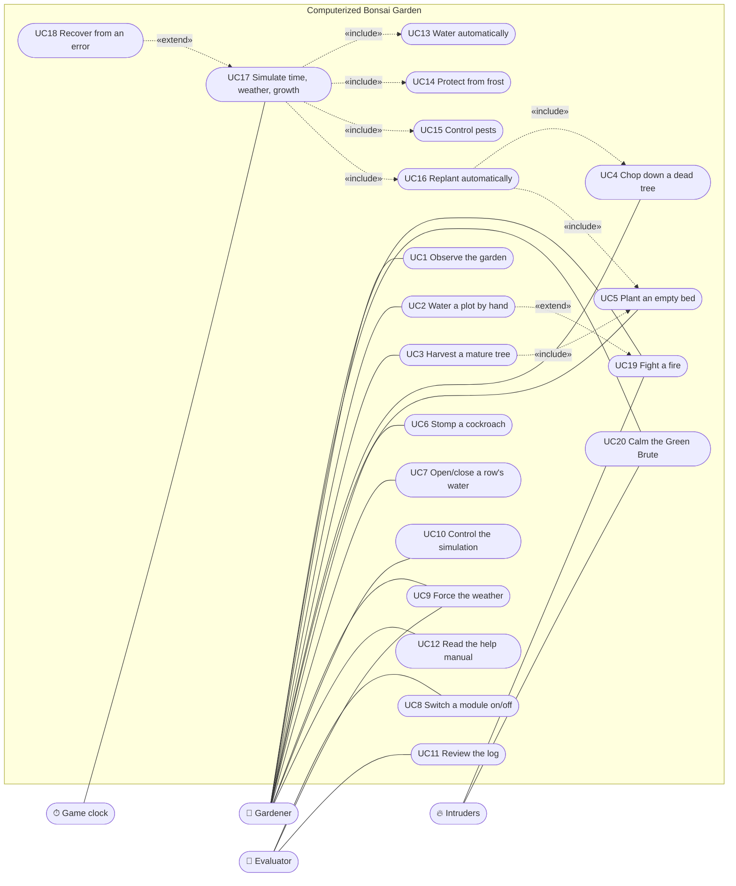
```mermaid
flowchart LR
    Gardener(["👤 Gardener"])
    Evaluator(["👤 Evaluator"])
    Clock(["⏱ Game clock"])

    subgraph System["Computerized Bonsai Garden"]
        UC1(["UC1 Observe the garden"])
        UC2(["UC2 Water a plot by hand"])
        UC3(["UC3 Harvest a mature tree"])
        UC4(["UC4 Chop down a dead tree"])
        UC5(["UC5 Plant an empty bed"])
        UC6(["UC6 Stomp a cockroach"])
        UC7(["UC7 Open/close a row's water"])
        UC8(["UC8 Switch a module on/off"])
        UC9(["UC9 Force the weather"])
        UC10(["UC10 Control the simulation"])
        UC11(["UC11 Review the log"])
        UC12(["UC12 Read the help manual"])
        UC13(["UC13 Water automatically"])
        UC14(["UC14 Protect from frost"])
        UC15(["UC15 Control pests"])
        UC16(["UC16 Replant automatically"])
        UC17(["UC17 Simulate time, weather, growth"])
        UC18(["UC18 Recover from an error"])
        UC19(["UC19 Fight a fire"])
        UC20(["UC20 Calm the Green Brute"])
    end
    Intruders(["🔥 Intruders"])
    Intruders --- UC19 & UC20
    Gardener --- UC19 & UC20
    UC2 -. "«extend»" .-> UC19

    Gardener --- UC1 & UC2 & UC3 & UC4 & UC5 & UC6 & UC7 & UC9 & UC10 & UC12
    Evaluator --- UC8 & UC9 & UC11
    Clock --- UC17
    UC17 -. "«include»" .-> UC13 & UC14 & UC15 & UC16
    UC3 -. "«include»" .-> UC5
    UC16 -. "«include»" .-> UC4
    UC16 -. "«include»" .-> UC5
    UC18 -. "«extend»" .-> UC17
```

---

## 2. Use case diagram: the scripted API

The Garden Simulation API is a second way to run the garden: a test script calls public methods and no window opens (see [API.md](API.md)). Every call first brings the simulation up to the current real time, so UC22 to UC26 all include UC27. The garden then looks after itself through the same automated modules (UC28).

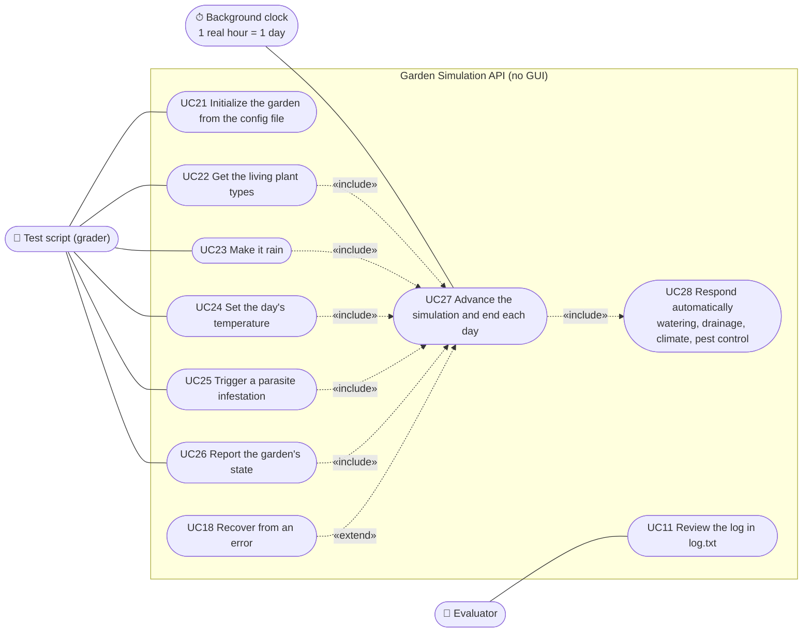
```mermaid
flowchart LR
    Script(["👤 Test script (grader)"])
    Evaluator(["👤 Evaluator"])
    Ticker(["⏱ Background clock<br/>1 real hour = 1 day"])

    subgraph API["Garden Simulation API (no GUI)"]
        UC21(["UC21 Initialize the garden from the config file"])
        UC22(["UC22 Get the living plant types"])
        UC23(["UC23 Make it rain"])
        UC24(["UC24 Set the day's temperature"])
        UC25(["UC25 Trigger a parasite infestation"])
        UC26(["UC26 Report the garden's state"])
        UC27(["UC27 Advance the simulation and end each day"])
        UC28(["UC28 Respond automatically<br/>watering, drainage, climate, pest control"])
        UC11b(["UC11 Review the log in log.txt"])
        UC18b(["UC18 Recover from an error"])
    end

    Script --- UC21 & UC22 & UC23 & UC24 & UC25 & UC26
    Ticker --- UC27
    Evaluator --- UC11b
    UC22 & UC23 & UC24 & UC25 & UC26 -. "«include»" .-> UC27
    UC27 -. "«include»" .-> UC28
    UC18b -. "«extend»" .-> UC27
```

If the script calls any method before `initializeGarden()`, UC21 runs first and a warning is logged.

---

## 3. Package diagram: how the parts fit together

Mermaid has no package diagram, so this is drawn as a flowchart: each box is a package or a group of classes, and an arrow means "depends on". The model in the middle is shared by the GUI and the API, which is why both behave the same way.

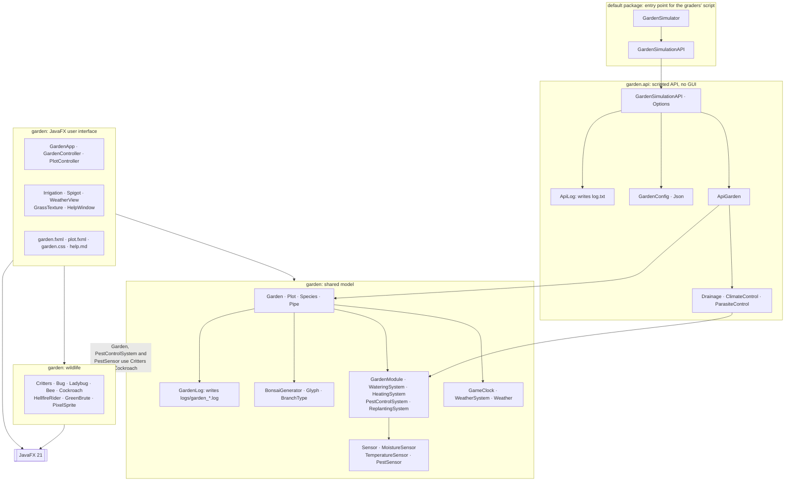
```mermaid
flowchart TB
    subgraph Default["default package: entry point for the graders' script"]
        SAPI["GardenSimulationAPI"]
        Sim["GardenSimulator"]
    end

    subgraph Api["garden.api: scripted API, no GUI"]
        CAPI["GardenSimulationAPI · Options"]
        AG["ApiGarden"]
        AMods["Drainage · ClimateControl · ParasiteControl"]
        Cfg["GardenConfig · Json"]
        ALog["ApiLog: writes log.txt"]
    end

    subgraph Model["garden: shared model"]
        G["Garden · Plot · Species · Pipe"]
        T["GameClock · WeatherSystem · Weather"]
        Mods["GardenModule · WateringSystem · HeatingSystem<br/>PestControlSystem · ReplantingSystem"]
        Sens["Sensor · MoistureSensor<br/>TemperatureSensor · PestSensor"]
        Gen["BonsaiGenerator · Glyph · BranchType"]
        Log["GardenLog: writes logs/garden_*.log"]
    end

    subgraph Wild["garden: wildlife"]
        Cr["Critters · Bug · Ladybug · Bee · Cockroach<br/>HellfireRider · GreenBrute · PixelSprite"]
    end

    subgraph GUI["garden: JavaFX user interface"]
        App["GardenApp · GardenController · PlotController"]
        Views["Irrigation · Spigot · WeatherView<br/>GrassTexture · HelpWindow"]
        Res["garden.fxml · plot.fxml · garden.css · help.md"]
    end

    JFX[["JavaFX 21"]]

    Sim --> SAPI --> CAPI
    CAPI --> AG & Cfg & ALog
    AG --> AMods
    AG --> G
    AMods --> Mods
    G --> T & Mods & Gen & Log
    Mods --> Sens
    GUI --> Model
    GUI --> Wild
    GUI --> JFX
    Wild --> JFX
    Model -. "Garden, PestControlSystem and<br/>PestSensor use Critters and Cockroach" .-> Wild
```

The dotted arrow is the one link from the model to JavaFX code: through it, compiling the API also needs JavaFX. Removing it (moving the wildlife's drawing out of the model) would make `garden.api` and the model compile on a plain JDK.

---

## 4. Class diagram: the garden model

`Garden` is the root of the model. It owns everything and advances it one step at a time. The GUI plants 40 plots on 5 pipes; the API plants however many the config file asks for (at least 10), 8 to a pipe.

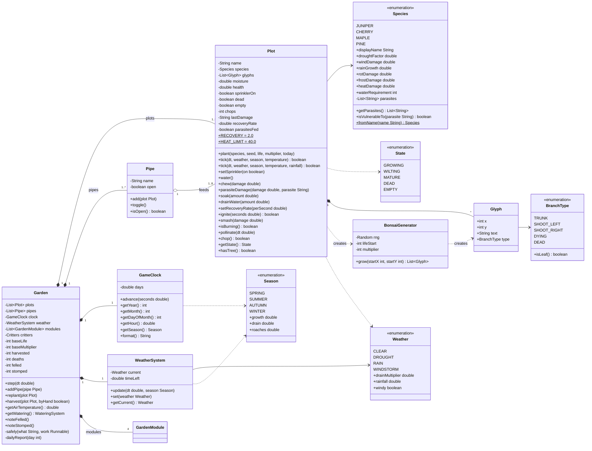
```mermaid
classDiagram
    direction LR

    class Garden {
        -List~Plot~ plots
        -List~Pipe~ pipes
        -GameClock clock
        -WeatherSystem weather
        -List~GardenModule~ modules
        -Critters critters
        -int baseLife
        -int baseMultiplier
        -int harvested
        -int deaths
        -int felled
        -int stomped
        +step(dt double)
        +addPipe(pipe Pipe)
        +replant(plot Plot)
        +harvest(plot Plot, byHand boolean)
        +getAirTemperature() double
        +getWatering() WateringSystem
        +noteFelled()
        +noteStomped()
        -safely(what String, work Runnable)
        -dailyReport(day int)
    }

    class Plot {
        -String name
        -Species species
        -List~Glyph~ glyphs
        -double moisture
        -double health
        -boolean sprinklerOn
        -boolean dead
        -boolean empty
        -int chops
        -String lastDamage
        -double recoveryRate
        -boolean parasitesFed
        +RECOVERY = 2.0$
        +HEAT_LIMIT = 40.0$
        +plant(species, seed, life, multiplier, today)
        +tick(dt, weather, season, temperature) boolean
        +tick(dt, weather, season, temperature, rainfall) boolean
        +setSprinkler(on boolean)
        +water()
        +chew(damage double)
        +parasiteDamage(damage double, parasite String)
        +soak(amount double)
        +drainWater(amount double)
        +setRecoveryRate(perSecond double)
        +ignite(seconds double) boolean
        +smash(damage double)
        +isBurning() boolean
        +pollinate(dt double)
        +chop() boolean
        +getState() State
        +hasTree() boolean
    }

    class State {
        <<enumeration>>
        GROWING
        WILTING
        MATURE
        DEAD
        EMPTY
    }

    class Species {
        <<enumeration>>
        JUNIPER
        CHERRY
        MAPLE
        PINE
        +displayName String
        +droughtFactor double
        +windDamage double
        +rainGrowth double
        +rotDamage double
        +frostDamage double
        +heatDamage double
        +waterRequirement int
        -List~String~ parasites
        +getParasites() List~String~
        +isVulnerableTo(parasite String) boolean
        +fromName(name String)$ Species
    }

    class Pipe {
        -String name
        -boolean open
        +add(plot Plot)
        +toggle()
        +isOpen() boolean
    }

    class GameClock {
        -double days
        +advance(seconds double)
        +getYear() int
        +getMonth() int
        +getDayOfMonth() int
        +getHour() double
        +getSeason() Season
        +format() String
    }

    class Season {
        <<enumeration>>
        SPRING
        SUMMER
        AUTUMN
        WINTER
        +growth double
        +drain double
        +roaches double
    }

    class WeatherSystem {
        -Weather current
        -double timeLeft
        +update(dt double, season Season)
        +set(weather Weather)
        +getCurrent() Weather
    }

    class Weather {
        <<enumeration>>
        CLEAR
        DROUGHT
        RAIN
        WINDSTORM
        +drainMultiplier double
        +rainfall double
        +windy boolean
    }

    class BonsaiGenerator {
        -Random rng
        -int lifeStart
        -int multiplier
        +grow(startX int, startY int) List~Glyph~
    }

    class Glyph {
        +int x
        +int y
        +String text
        +BranchType type
    }

    class BranchType {
        <<enumeration>>
        TRUNK
        SHOOT_LEFT
        SHOOT_RIGHT
        DYING
        DEAD
        +isLeaf() boolean
    }

    Garden "1" *-- "1..*" Plot : plots
    Garden "1" *-- "1..*" Pipe : pipes
    Garden "1" *-- "1" GameClock
    Garden "1" *-- "1" WeatherSystem
    Garden "1" *-- "4" GardenModule : modules
    Pipe "1" o-- "1..8" Plot : feeds
    Plot --> Species
    Plot ..> State
    Plot "1" *-- "*" Glyph
    Plot ..> BonsaiGenerator : creates
    BonsaiGenerator ..> Glyph : creates
    Glyph --> BranchType
    GameClock ..> Season
    WeatherSystem --> Weather
    WeatherSystem ..> Season
    Plot ..> Weather
```

---

## 5. Class diagram: modules and sensors

Each automated subsystem extends `GardenModule`. `update()` is a **template method**: it is final, checks whether the module is enabled, then calls the subclass's `run()`. Modules read the world only through `Sensor`s. The API reuses `WateringSystem` and adds three more subclasses of its own (`Drainage`, `ClimateControl`, `ParasiteControl`), shown in [the API class diagram](#8-class-diagram-the-garden-simulation-api).

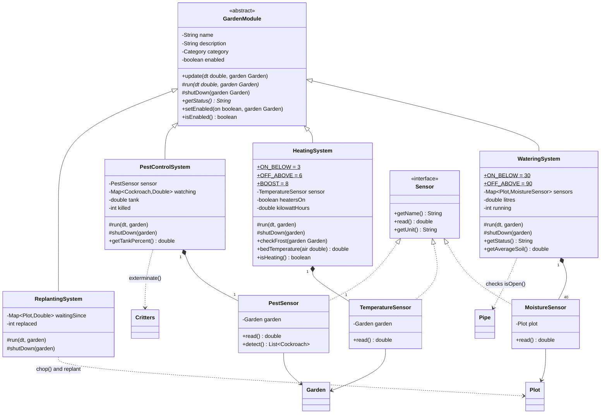
```mermaid
classDiagram
    direction TB

    class GardenModule {
        <<abstract>>
        -String name
        -String description
        -Category category
        -boolean enabled
        +update(dt double, garden Garden)
        #run(dt double, garden Garden)*
        #shutDown(garden Garden)
        +getStatus()* String
        +setEnabled(on boolean, garden Garden)
        +isEnabled() boolean
    }

    class WateringSystem {
        +ON_BELOW = 30$
        +OFF_ABOVE = 90$
        -Map~Plot,MoistureSensor~ sensors
        -double litres
        -int running
        #run(dt, garden)
        #shutDown(garden)
        +getStatus() String
        +getAverageSoil() double
    }

    class HeatingSystem {
        +ON_BELOW = 3$
        +OFF_ABOVE = 6$
        +BOOST = 8$
        -TemperatureSensor sensor
        -boolean heatersOn
        -double kilowattHours
        #run(dt, garden)
        #shutDown(garden)
        +checkFrost(garden Garden)
        +bedTemperature(air double) double
        +isHeating() boolean
    }

    class PestControlSystem {
        -PestSensor sensor
        -Map~Cockroach,Double~ watching
        -double tank
        -int killed
        #run(dt, garden)
        #shutDown(garden)
        +getTankPercent() double
    }

    class ReplantingSystem {
        -Map~Plot,Double~ waitingSince
        -int replaced
        #run(dt, garden)
        #shutDown(garden)
    }

    class Sensor {
        <<interface>>
        +getName() String
        +read() double
        +getUnit() String
    }

    class MoistureSensor {
        -Plot plot
        +read() double
    }

    class TemperatureSensor {
        -Garden garden
        +read() double
    }

    class PestSensor {
        -Garden garden
        +read() double
        +detect() List~Cockroach~
    }

    GardenModule <|-- WateringSystem
    GardenModule <|-- HeatingSystem
    GardenModule <|-- PestControlSystem
    GardenModule <|-- ReplantingSystem

    Sensor <|.. MoistureSensor
    Sensor <|.. TemperatureSensor
    Sensor <|.. PestSensor

    WateringSystem "1" *-- "40" MoistureSensor
    HeatingSystem "1" *-- "1" TemperatureSensor
    PestControlSystem "1" *-- "1" PestSensor

    MoistureSensor --> Plot
    TemperatureSensor --> Garden
    PestSensor --> Garden
    PestControlSystem ..> Critters : exterminate()
    ReplantingSystem ..> Plot : chop() and replant
    WateringSystem ..> Pipe : checks isOpen()
```

---

## 6. Class diagram: wildlife

`Critters` updates and draws every insect and intruder **polymorphically** through the abstract `Bug` methods. The two intruders are drawn as pixel art with `PixelSprite`.

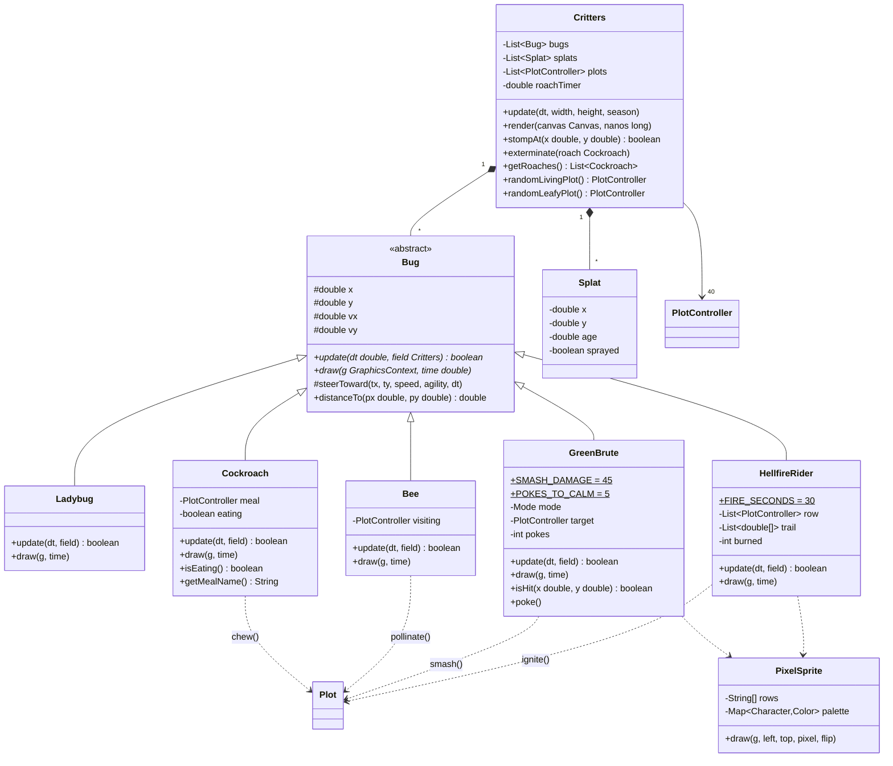
```mermaid
classDiagram
    direction TB

    class Critters {
        -List~Bug~ bugs
        -List~Splat~ splats
        -List~PlotController~ plots
        -double roachTimer
        +update(dt, width, height, season)
        +render(canvas Canvas, nanos long)
        +stompAt(x double, y double) boolean
        +exterminate(roach Cockroach)
        +getRoaches() List~Cockroach~
        +randomLivingPlot() PlotController
        +randomLeafyPlot() PlotController
    }

    class Bug {
        <<abstract>>
        #double x
        #double y
        #double vx
        #double vy
        +update(dt double, field Critters)* boolean
        +draw(g GraphicsContext, time double)*
        #steerToward(tx, ty, speed, agility, dt)
        +distanceTo(px double, py double) double
    }

    class Ladybug {
        +update(dt, field) boolean
        +draw(g, time)
    }

    class Bee {
        -PlotController visiting
        +update(dt, field) boolean
        +draw(g, time)
    }

    class Cockroach {
        -PlotController meal
        -boolean eating
        +update(dt, field) boolean
        +draw(g, time)
        +isEating() boolean
        +getMealName() String
    }

    class HellfireRider {
        +FIRE_SECONDS = 30$
        -List~PlotController~ row
        -List~double[]~ trail
        -int burned
        +update(dt, field) boolean
        +draw(g, time)
    }

    class GreenBrute {
        +SMASH_DAMAGE = 45$
        +POKES_TO_CALM = 5$
        -Mode mode
        -PlotController target
        -int pokes
        +update(dt, field) boolean
        +draw(g, time)
        +isHit(x double, y double) boolean
        +poke()
    }

    class PixelSprite {
        -String[] rows
        -Map~Character,Color~ palette
        +draw(g, left, top, pixel, flip)
    }

    class Splat {
        -double x
        -double y
        -double age
        -boolean sprayed
    }

    Bug <|-- Ladybug
    Bug <|-- Bee
    Bug <|-- Cockroach
    Bug <|-- HellfireRider
    Bug <|-- GreenBrute
    HellfireRider ..> PixelSprite
    GreenBrute ..> PixelSprite
    HellfireRider ..> Plot : ignite()
    GreenBrute ..> Plot : smash()
    Critters "1" *-- "*" Bug
    Critters "1" *-- "*" Splat
    Bee ..> Plot : pollinate()
    Cockroach ..> Plot : chew()
    Critters --> "40" PlotController
```

---

## 7. Class diagram: user interface and logging

`GardenLog` has no JavaFX code: it hands every entry to a `Listener`. The GUI's listener puts entries in the Log tab; the API's listener copies plant events into `log.txt`.

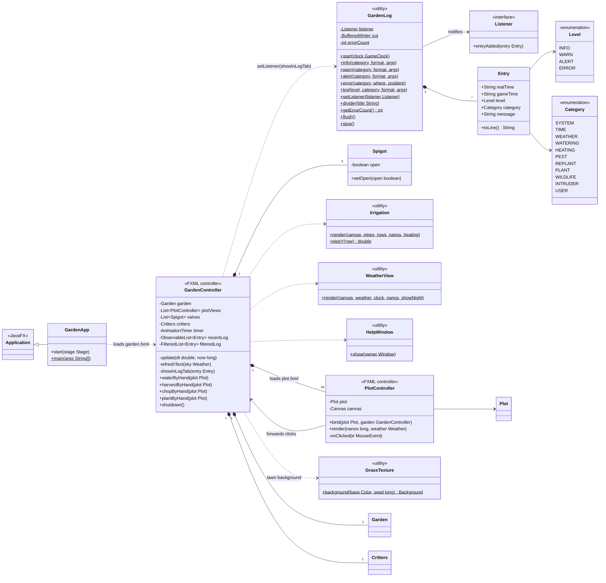
```mermaid
classDiagram
    direction LR

    class Application {
        <<JavaFX>>
    }

    class GardenApp {
        +start(stage Stage)
        +main(args String[])$
    }

    class GardenController {
        <<FXML controller>>
        -Garden garden
        -List~PlotController~ plotViews
        -List~Spigot~ valves
        -Critters critters
        -AnimationTimer timer
        -ObservableList~Entry~ recentLog
        -FilteredList~Entry~ filteredLog
        -update(dt double, now long)
        -refreshText(sky Weather)
        -showInLogTab(entry Entry)
        +waterByHand(plot Plot)
        +harvestByHand(plot Plot)
        +chopByHand(plot Plot)
        +plantByHand(plot Plot)
        +shutdown()
    }

    class PlotController {
        <<FXML controller>>
        -Plot plot
        -Canvas canvas
        +bind(plot Plot, garden GardenController)
        +render(nanos long, weather Weather)
        -onClicked(e MouseEvent)
    }

    class Spigot {
        -boolean open
        +setOpen(open boolean)
    }

    class Irrigation {
        <<utility>>
        +render(canvas, pipes, rows, nanos, heating)$
        +pipeY(row)$ double
    }

    class WeatherView {
        <<utility>>
        +render(canvas, weather, clock, nanos, showNight)$
    }

    class HelpWindow {
        <<utility>>
        +show(owner Window)$
    }

    class GardenLog {
        <<utility>>
        -Listener listener$
        -BufferedWriter out$
        -int errorCount$
        +start(clock GameClock)$
        +info(category, format, args)$
        +warn(category, format, args)$
        +alert(category, format, args)$
        +error(category, where, problem)$
        +log(level, category, format, args)$
        +setListener(listener Listener)$
        +divider(title String)$
        +getErrorCount()$ int
        +flush()$
        +stop()$
    }

    class Listener {
        <<interface>>
        +entryAdded(entry Entry)
    }

    class GrassTexture {
        <<utility>>
        +background(base Color, seed long)$ Background
    }

    class Entry {
        +String realTime
        +String gameTime
        +Level level
        +Category category
        +String message
        +toLine() String
    }

    class Level {
        <<enumeration>>
        INFO
        WARN
        ALERT
        ERROR
    }

    class Category {
        <<enumeration>>
        SYSTEM
        TIME
        WEATHER
        WATERING
        HEATING
        PEST
        REPLANT
        PLANT
        WILDLIFE
        INTRUDER
        USER
    }

    Application <|-- GardenApp
    GardenApp ..> GardenController : loads garden.fxml
    GardenController "1" *-- "1" Garden
    GardenController "1" *-- "40" PlotController : loads plot.fxml
    GardenController "1" *-- "5" Spigot
    GardenController "1" *-- "1" Critters
    PlotController --> Plot
    PlotController --> GardenController : forwards clicks
    GardenController ..> Irrigation
    GardenController ..> WeatherView
    GardenController ..> HelpWindow
    GardenController ..> GardenLog : setListener(showInLogTab)
    GardenController ..> GrassTexture : lawn background
    GardenLog --> Listener : notifies
    GardenLog "1" *-- "*" Entry
    Entry --> Level
    Entry --> Category
```

---

## 8. Class diagram: the Garden Simulation API

`garden.api.GardenSimulationAPI` is a **facade**: six public methods hide the whole simulation. The copy in the default package only extends it, so a grader's script needs no imports. `ApiGarden` **reuses** the model (`Garden`, `Plot`, `Species`, `WateringSystem`, `GardenModule`, `MoistureSensor`) instead of copying it, and adds three modules of its own. Classes from other diagrams are shown here by name only. Each of the three API modules also keeps a reference back to its `ApiGarden`, to write to `log.txt`; those arrows are left out to keep the diagram readable.

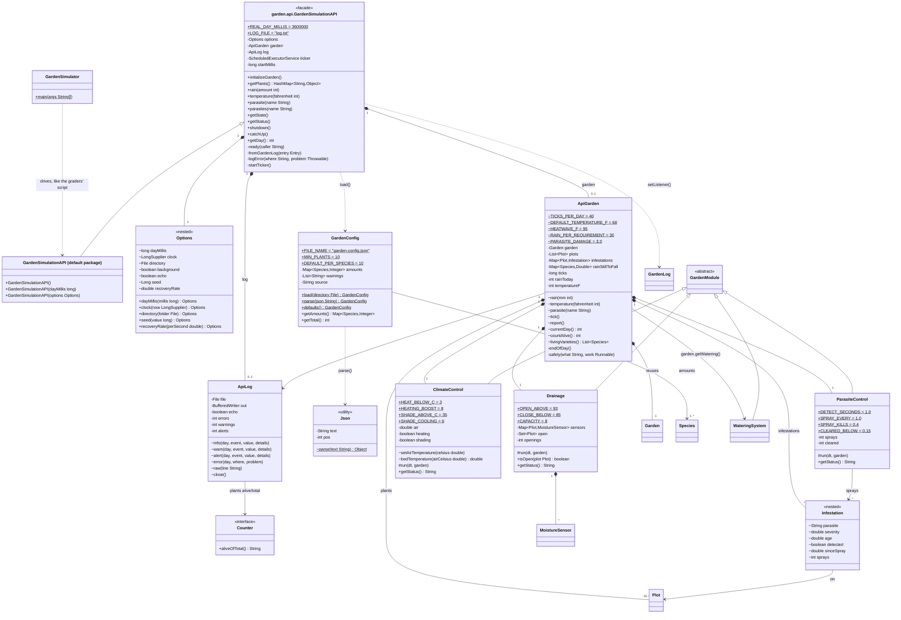
```mermaid
classDiagram
    direction TB

    class GardenSimulator {
        +main(args String[])$
    }

    class ScriptAPI["GardenSimulationAPI (default package)"] {
        +GardenSimulationAPI()
        +GardenSimulationAPI(dayMillis long)
        +GardenSimulationAPI(options Options)
    }

    class CoreAPI["garden.api.GardenSimulationAPI"] {
        <<facade>>
        +REAL_DAY_MILLIS = 3600000$
        +LOG_FILE = "log.txt"$
        -Options options
        -ApiGarden garden
        -ApiLog log
        -ScheduledExecutorService ticker
        -long startMillis
        +initializeGarden()
        +getPlants() HashMap~String,Object~
        +rain(amount int)
        +temperature(fahrenheit int)
        +parasite(name String)
        +parasites(name String)
        +getState()
        +getStatus()
        +shutdown()
        +catchUp()
        +getDay() int
        -ready(caller String)
        -fromGardenLog(entry Entry)
        -logError(where String, problem Throwable)
        -startTicker()
    }

    class Options {
        <<nested>>
        ~long dayMillis
        ~LongSupplier clock
        ~File directory
        ~boolean background
        ~boolean echo
        ~Long seed
        ~double recoveryRate
        +dayMillis(millis long) Options
        +clock(now LongSupplier) Options
        +directory(folder File) Options
        +seed(value long) Options
        +recoveryRate(perSecond double) Options
    }

    class ApiGarden {
        ~TICKS_PER_DAY = 40$
        ~DEFAULT_TEMPERATURE_F = 68$
        ~HEATWAVE_F = 95$
        ~RAIN_PER_REQUIREMENT = 30$
        ~PARASITE_DAMAGE = 3.0$
        -Garden garden
        -List~Plot~ plots
        -Map~Plot,Infestation~ infestations
        -Map~Species,Double~ rainStillToFall
        -long ticks
        -int rainToday
        -int temperatureF
        ~rain(mm int)
        ~temperature(fahrenheit int)
        ~parasite(name String)
        ~tick()
        ~report()
        ~currentDay() int
        ~countAlive() int
        ~livingVarieties() List~Species~
        -endOfDay()
        -safely(what String, work Runnable)
    }

    class ApiLog {
        -File file
        -BufferedWriter out
        -boolean echo
        -int errors
        -int warnings
        -int alerts
        ~info(day, event, value, details)
        ~warn(day, event, value, details)
        ~alert(day, event, value, details)
        ~error(day, where, problem)
        ~raw(line String)
        ~close()
    }

    class Counter {
        <<interface>>
        +aliveOfTotal() String
    }

    class GardenConfig {
        +FILE_NAME = "garden-config.json"$
        +MIN_PLANTS = 10$
        +DEFAULT_PER_SPECIES = 10$
        -Map~Species,Integer~ amounts
        -List~String~ warnings
        -String source
        +load(directory File)$ GardenConfig
        +parse(json String)$ GardenConfig
        +defaults()$ GardenConfig
        +getAmounts() Map~Species,Integer~
        +getTotal() int
    }

    class Json {
        <<utility>>
        -String text
        -int pos
        ~parse(text String)$ Object
    }

    class ParasiteControl {
        +DETECT_SECONDS = 1.0$
        +SPRAY_EVERY = 1.0$
        +SPRAY_KILLS = 0.4$
        +CLEARED_BELOW = 0.15$
        -int sprays
        -int cleared
        #run(dt, garden)
        +getStatus() String
    }

    class Infestation {
        <<nested>>
        ~String parasite
        ~double severity
        ~double age
        ~boolean detected
        ~double sinceSpray
        ~int sprays
    }

    class ClimateControl {
        +HEAT_BELOW_C = 3$
        +HEATING_BOOST = 8$
        +SHADE_ABOVE_C = 35$
        +SHADE_COOLING = 6$
        -double air
        -boolean heating
        -boolean shading
        ~setAirTemperature(celsius double)
        ~bedTemperature(airCelsius double) double
        #run(dt, garden)
        +getStatus() String
    }

    class Drainage {
        +OPEN_ABOVE = 93$
        +CLOSE_BELOW = 85$
        +CAPACITY = 8$
        -Map~Plot,MoistureSensor~ sensors
        -Set~Plot~ open
        -int openings
        #run(dt, garden)
        +isOpen(plot Plot) boolean
        +getStatus() String
    }

    class GardenModule {
        <<abstract>>
    }
    class Garden
    class Plot
    class Species
    class WateringSystem
    class MoistureSensor
    class GardenLog

    GardenSimulator ..> ScriptAPI : drives, like the graders' script
    CoreAPI <|-- ScriptAPI
    CoreAPI "1" *-- "1" Options
    CoreAPI "1" *-- "0..1" ApiGarden : garden
    CoreAPI "1" *-- "0..1" ApiLog : log
    CoreAPI ..> GardenConfig : load()
    CoreAPI ..> GardenLog : setListener()
    GardenConfig ..> Json : parse()
    GardenConfig --> "1..*" Species : amounts
    ApiLog --> Counter : plants alive/total

    ApiGarden "1" *-- "1" Garden : reuses
    ApiGarden "1" *-- "10..*" Plot : plants
    ApiGarden "1" *-- "1" Drainage
    ApiGarden "1" *-- "1" ClimateControl
    ApiGarden "1" *-- "1" ParasiteControl
    ApiGarden --> WateringSystem : garden.getWatering()
    ApiGarden "1" *-- "*" Infestation : infestations
    ApiGarden --> ApiLog
    ParasiteControl --> "*" Infestation : sprays
    Infestation --> Plot : on

    GardenModule <|-- WateringSystem
    GardenModule <|-- Drainage
    GardenModule <|-- ClimateControl
    GardenModule <|-- ParasiteControl
    Drainage "1" *-- "*" MoistureSensor
```

---

## 9. State diagram: a plot

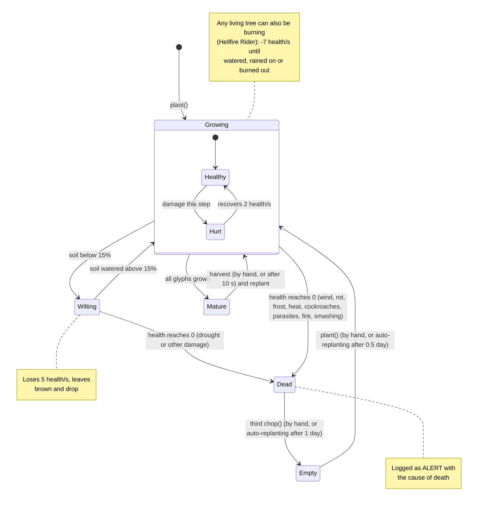
```mermaid
stateDiagram-v2
    [*] --> Growing : plant()

    Growing --> Wilting : soil below 15%
    Wilting --> Growing : soil watered above 15%
    Growing --> Mature : all glyphs grown
    Mature --> Growing : harvest (by hand, or after 10 s) and replant

    Growing --> Dead : health reaches 0 (wind, rot, frost, heat, cockroaches, parasites, fire, smashing)
    Wilting --> Dead : health reaches 0 (drought or other damage)

    Dead --> Empty : third chop() (by hand, or auto-replanting after 1 day)
    Empty --> Growing : plant() (by hand, or auto-replanting after 0.5 day)

    state Growing {
        [*] --> Healthy
        Healthy --> Hurt : damage this step
        Hurt --> Healthy : recovers 2 health/s
    }

    note right of Wilting
        Loses 5 health/s, leaves
        brown and drop
    end note
    note left of Growing
        Any living tree can also be burning
        (Hellfire Rider): -7 health/s until
        watered, rained on or burned out
    end note
    note right of Dead
        Logged as ALERT with
        the cause of death
    end note
```

---

## 10. State diagram: a parasite infestation

What happens on one plant after `parasite(name)` on the API. `ApiGarden` keeps one `Infestation` per plant; `ParasiteControl` moves it through these states.

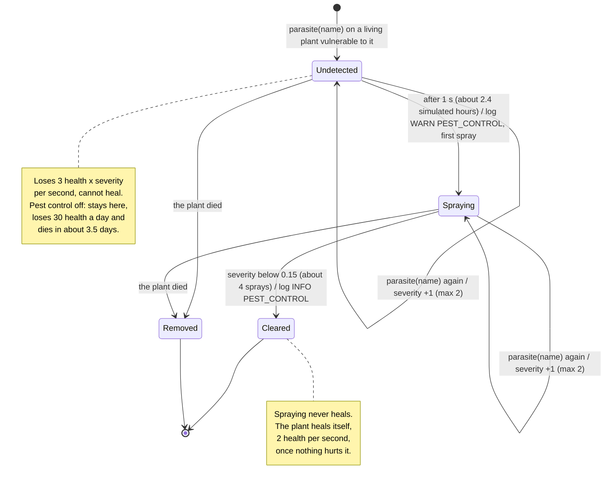
```mermaid
stateDiagram-v2
    [*] --> Undetected : parasite(name) on a living plant vulnerable to it

    Undetected --> Undetected : parasite(name) again / severity +1 (max 2)
    Undetected --> Spraying : after 1 s (about 2.4 simulated hours) / log WARN PEST_CONTROL, first spray
    Spraying --> Spraying : every 1 s / spray kills 40% (severity x 0.6)
    Spraying --> Spraying : parasite(name) again / severity +1 (max 2)
    Spraying --> Cleared : severity below 0.15 (about 4 sprays) / log INFO PEST_CONTROL
    Cleared --> [*]

    Undetected --> Removed : the plant died
    Spraying --> Removed : the plant died
    Removed --> [*]

    note right of Undetected
        Loses 3 health x severity
        per second, cannot heal.
        Pest control off: stays here,
        loses 30 health a day and
        dies in about 3.5 days.
    end note
    note right of Cleared
        Spraying never heals.
        The plant heals itself,
        2 health per second,
        once nothing hurts it.
    end note
```

---

## 11. Sequence diagram: one simulation step

`GardenController`'s `AnimationTimer` calls `Garden.step(dt)` many times per frame (dt ≤ 0.25 s). Every module and plot runs inside `safely(...)`, so one failure can't stop the rest.

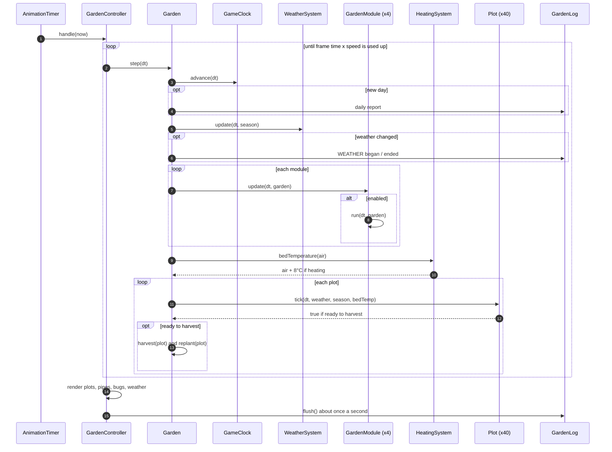
```mermaid
sequenceDiagram
    autonumber
    participant Timer as AnimationTimer
    participant GC as GardenController
    participant G as Garden
    participant Clock as GameClock
    participant WS as WeatherSystem
    participant M as GardenModule (x4)
    participant H as HeatingSystem
    participant P as Plot (x40)
    participant Log as GardenLog

    Timer->>GC: handle(now)
    loop until frame time x speed is used up
        GC->>G: step(dt)
        G->>Clock: advance(dt)
        opt new day
            G->>Log: daily report
        end
        G->>WS: update(dt, season)
        opt weather changed
            G->>Log: WEATHER began / ended
        end
        loop each module
            G->>M: update(dt, garden)
            alt enabled
                M->>M: run(dt, garden)
            end
        end
        G->>H: bedTemperature(air)
        H-->>G: air + 8°C if heating
        loop each plot
            G->>P: tick(dt, weather, season, bedTemp)
            P-->>G: true if ready to harvest
            opt ready to harvest
                G->>G: harvest(plot) and replant(plot)
            end
        end
    end
    GC->>GC: render plots, pipes, bugs, weather
    GC->>Log: flush() about once a second
```

---

## 12. Sequence diagram: a cockroach attack

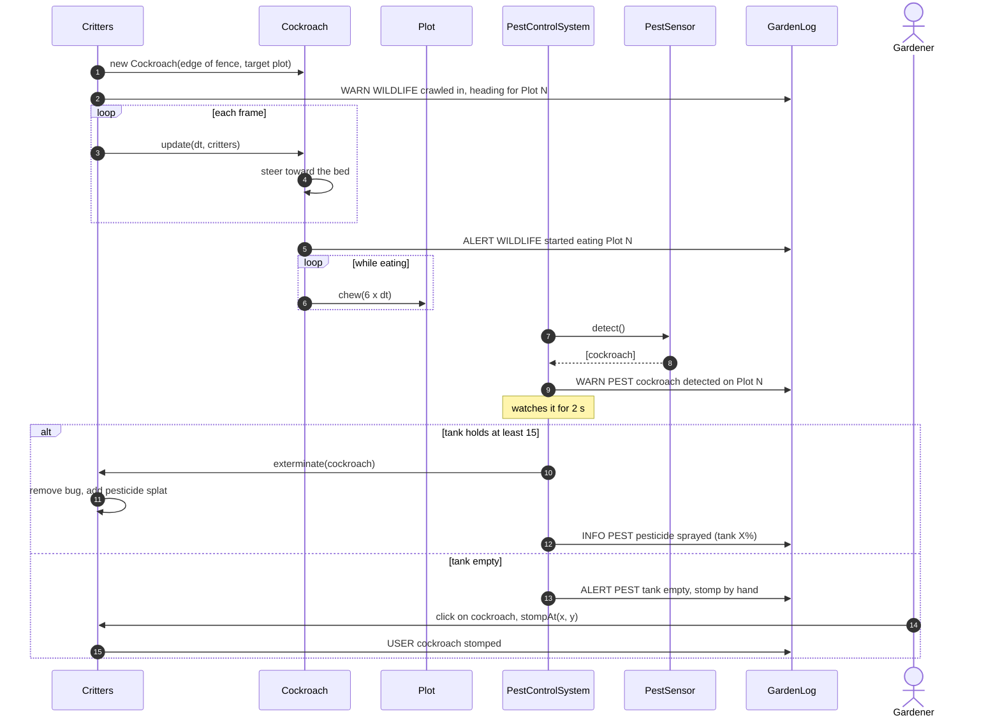
```mermaid
sequenceDiagram
    autonumber
    participant C as Critters
    participant R as Cockroach
    participant P as Plot
    participant PC as PestControlSystem
    participant S as PestSensor
    participant Log as GardenLog
    actor Gardener

    C->>R: new Cockroach(edge of fence, target plot)
    C->>Log: WARN WILDLIFE crawled in, heading for Plot N
    loop each frame
        C->>R: update(dt, critters)
        R->>R: steer toward the bed
    end
    R->>Log: ALERT WILDLIFE started eating Plot N
    loop while eating
        R->>P: chew(6 x dt)
    end

    PC->>S: detect()
    S-->>PC: [cockroach]
    PC->>Log: WARN PEST cockroach detected on Plot N
    Note over PC: watches it for 2 s
    alt tank holds at least 15
        PC->>C: exterminate(cockroach)
        C->>C: remove bug, add pesticide splat
        PC->>Log: INFO PEST pesticide sprayed (tank X%)
    else tank empty
        PC->>Log: ALERT PEST tank empty, stomp by hand
        Gardener->>C: click on cockroach, stompAt(x, y)
        C->>Log: USER cockroach stomped
    end
```

---

## 13. Sequence diagram: the gardener clicks a plot

The field's click filter tries a stomp first. Only if no cockroach is hit does the click reach the plot, where the plot's state chooses the action.

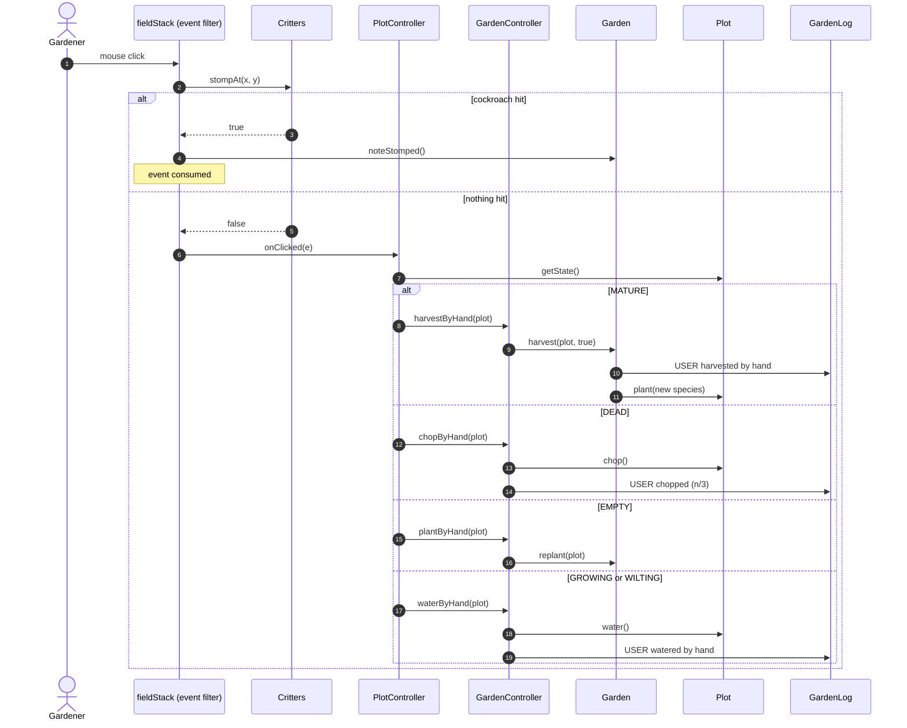
```mermaid
sequenceDiagram
    autonumber
    actor Gardener
    participant Field as fieldStack (event filter)
    participant C as Critters
    participant PV as PlotController
    participant GC as GardenController
    participant G as Garden
    participant P as Plot
    participant Log as GardenLog

    Gardener->>Field: mouse click
    Field->>C: stompAt(x, y)
    alt cockroach hit
        C-->>Field: true
        Field->>G: noteStomped()
        Note over Field: event consumed
    else nothing hit
        C-->>Field: false
        Field->>PV: onClicked(e)
        PV->>P: getState()
        alt MATURE
            PV->>GC: harvestByHand(plot)
            GC->>G: harvest(plot, true)
            G->>Log: USER harvested by hand
            G->>P: plant(new species)
        else DEAD
            PV->>GC: chopByHand(plot)
            GC->>P: chop()
            GC->>Log: USER chopped (n/3)
        else EMPTY
            PV->>GC: plantByHand(plot)
            GC->>G: replant(plot)
        else GROWING or WILTING
            PV->>GC: waterByHand(plot)
            GC->>P: water()
            GC->>Log: USER watered by hand
        end
    end
```

---

## 14. Sequence diagram: one simulated API day

How a test script drives the garden. The `garden-clock` thread keeps the simulation and `log.txt` moving between calls, and every call also catches up with the clock first, so each event lands on the right day.

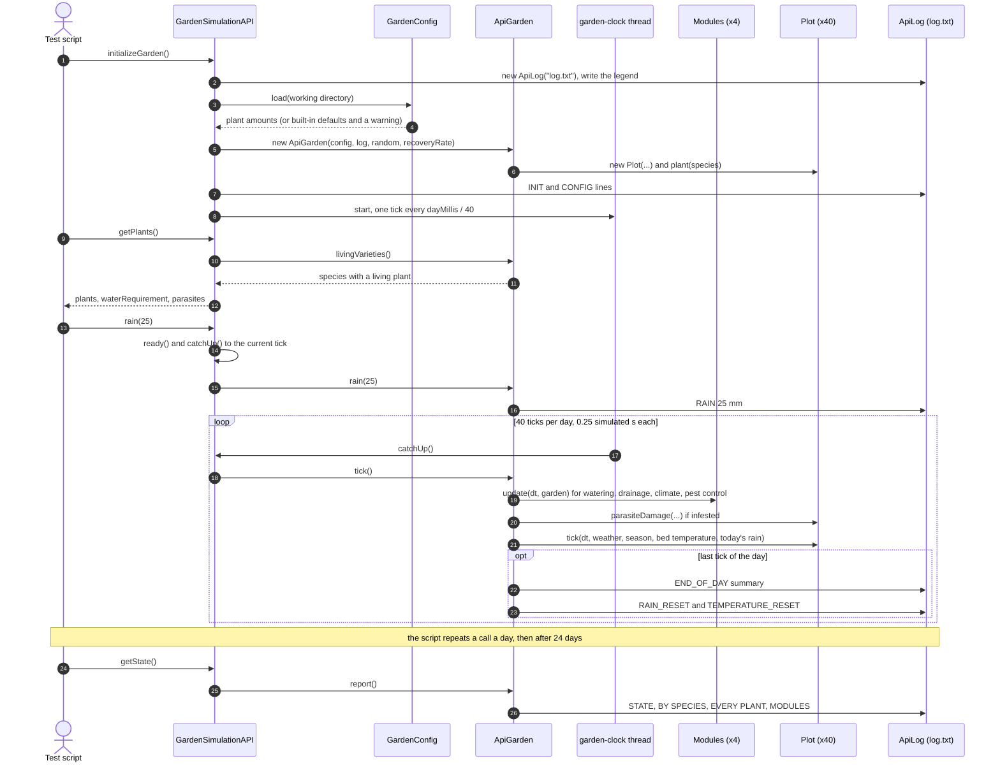
```mermaid
sequenceDiagram
    autonumber
    actor Script as Test script
    participant API as GardenSimulationAPI
    participant Cfg as GardenConfig
    participant AG as ApiGarden
    participant Clock as garden-clock thread
    participant M as Modules (x4)
    participant P as Plot (x40)
    participant Log as ApiLog (log.txt)

    Script->>API: initializeGarden()
    API->>Log: new ApiLog("log.txt"), write the legend
    API->>Cfg: load(working directory)
    Cfg-->>API: plant amounts (or built-in defaults and a warning)
    API->>AG: new ApiGarden(config, log, random, recoveryRate)
    AG->>P: new Plot(...) and plant(species)
    API->>Log: INIT and CONFIG lines
    API->>Clock: start, one tick every dayMillis / 40

    Script->>API: getPlants()
    API->>AG: livingVarieties()
    AG-->>API: species with a living plant
    API-->>Script: plants, waterRequirement, parasites

    Script->>API: rain(25)
    API->>API: ready() and catchUp() to the current tick
    API->>AG: rain(25)
    AG->>Log: RAIN 25 mm

    loop 40 ticks per day, 0.25 simulated s each
        Clock->>API: catchUp()
        API->>AG: tick()
        AG->>M: update(dt, garden) for watering, drainage, climate, pest control
        AG->>P: parasiteDamage(...) if infested
        AG->>P: tick(dt, weather, season, bed temperature, today's rain)
        opt last tick of the day
            AG->>Log: END_OF_DAY summary
            AG->>Log: RAIN_RESET and TEMPERATURE_RESET
        end
    end

    Note over Script,Log: the script repeats a call a day, then after 24 days
    Script->>API: getState()
    API->>AG: report()
    AG->>Log: STATE, BY SPECIES, EVERY PLANT, MODULES
```

---

## 15. Activity diagram: watering decision

This is what `WateringSystem.run` decides for each plot on every step.

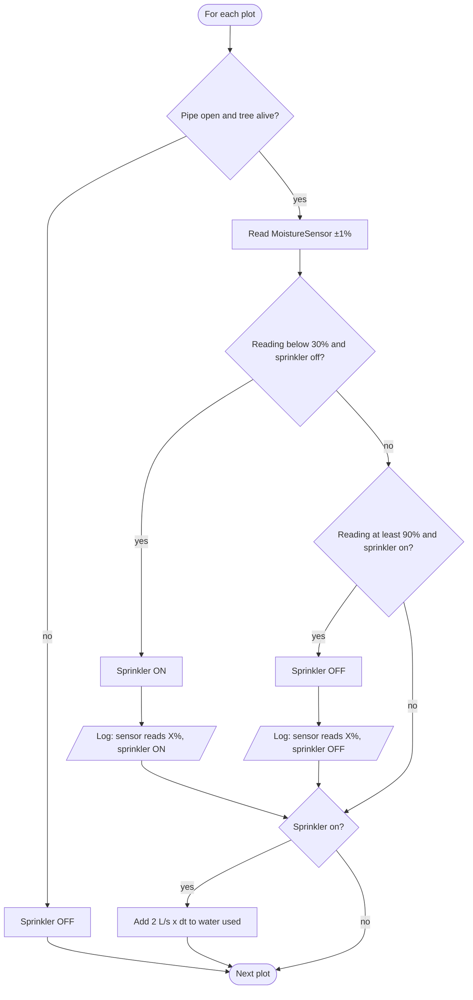
```mermaid
flowchart TD
    A([For each plot]) --> B{Pipe open and tree alive?}
    B -- no --> C[Sprinkler OFF] --> Z([Next plot])
    B -- yes --> D[Read MoistureSensor ±1%]
    D --> E{Reading below 30% and sprinkler off?}
    E -- yes --> F[Sprinkler ON] --> F2[/Log: sensor reads X%, sprinkler ON/] --> W
    E -- no --> G{Reading at least 90% and sprinkler on?}
    G -- yes --> H[Sprinkler OFF] --> H2[/Log: sensor reads X%, sprinkler OFF/] --> W
    G -- no --> W{Sprinkler on?}
    W -- yes --> L[Add 2 L/s x dt to water used] --> Z
    W -- no --> Z
```

---

## 16. Activity diagram: frame loop with error recovery

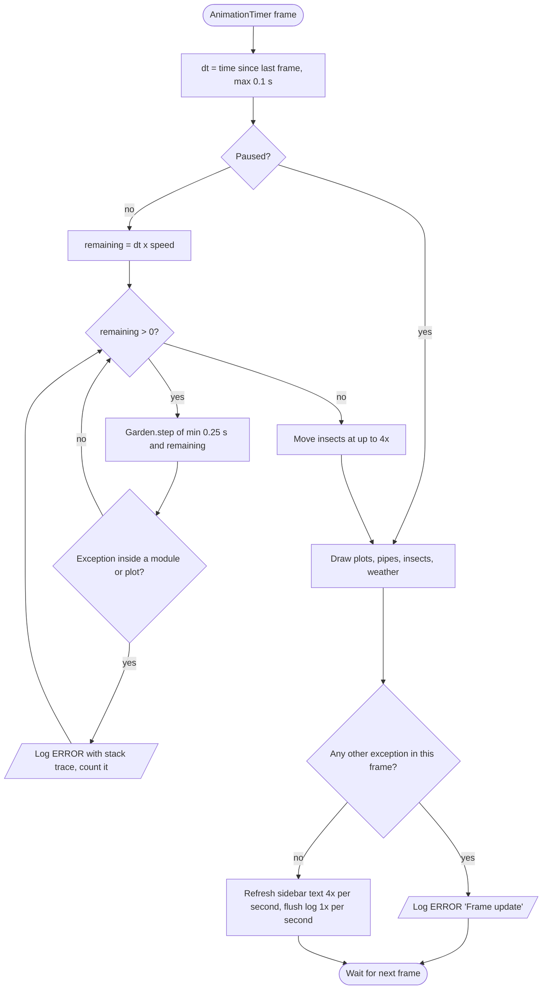
```mermaid
flowchart TD
    S([AnimationTimer frame]) --> T[dt = time since last frame, max 0.1 s]
    T --> P{Paused?}
    P -- yes --> R
    P -- no --> Q[remaining = dt x speed]
    Q --> L{remaining > 0?}
    L -- yes --> St[Garden.step of min 0.25 s and remaining]
    St --> Safe{Exception inside a module or plot?}
    Safe -- yes --> E1[/Log ERROR with stack trace, count it/] --> L
    Safe -- no --> L
    L -- no --> B[Move insects at up to 4x]
    B --> R[Draw plots, pipes, insects, weather]
    R --> X{Any other exception in this frame?}
    X -- yes --> E2[/Log ERROR 'Frame update'/] --> N
    X -- no --> U[Refresh sidebar text 4x per second, flush log 1x per second]
    U --> N([Wait for next frame])
```

---

## 17. Activity diagram: an API call with error recovery

Every public API method follows this path, which is why no call ever throws back to the test script.

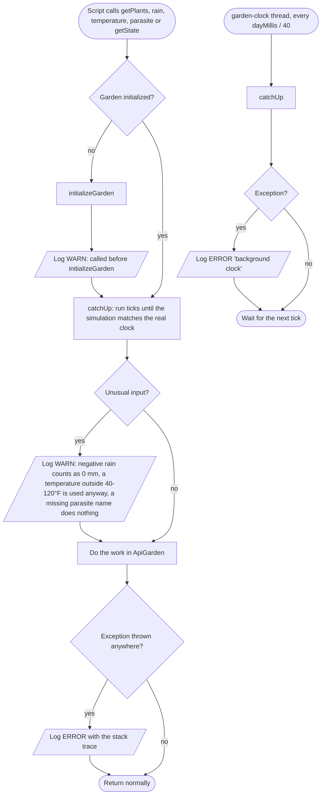
```mermaid
flowchart TD
    S([Script calls getPlants, rain, temperature, parasite or getState]) --> I{Garden initialized?}
    I -- no --> Init[initializeGarden] --> W[/Log WARN: called before initializeGarden/] --> C
    I -- yes --> C[catchUp: run ticks until the simulation matches the real clock]
    C --> V{Unusual input?}
    V -- yes --> Fix[/Log WARN: negative rain counts as 0 mm, a temperature outside 40-120°F is used anyway, a missing parasite name does nothing/] --> Do
    V -- no --> Do[Do the work in ApiGarden]
    Do --> X{Exception thrown anywhere?}
    X -- yes --> E[/Log ERROR with the stack trace/] --> R
    X -- no --> R([Return normally])

    T([garden-clock thread, every dayMillis / 40]) --> TC[catchUp]
    TC --> TX{Exception?}
    TX -- yes --> TE[/Log ERROR 'background clock'/] --> TN([Wait for the next tick])
    TX -- no --> TN
```

Inside `ApiGarden.tick()`, each module and each plot also runs inside its own `safely(...)`, so one failing plant can't stop the others.
